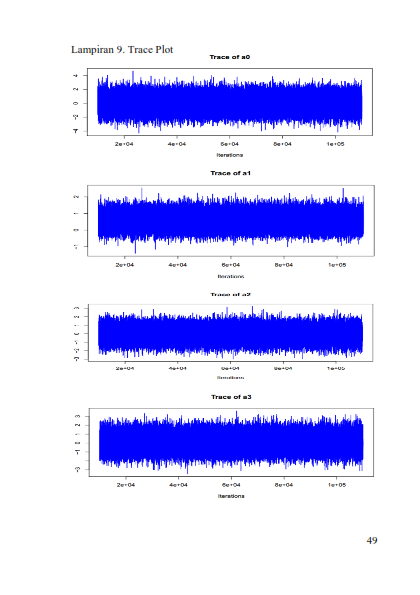
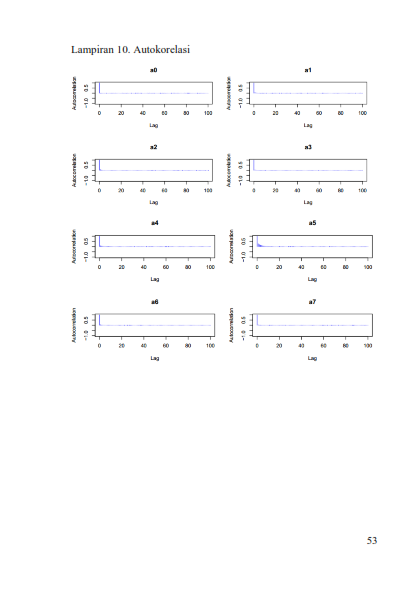

### Bayesian Zero Inflated Poisson
Metode ini adalah merupakan skripsi penulis sendiri. Metode ini digunakan jika
1. Variabel dependen bersifat kategori
2. Nilai variabel dependen banyak yang nol
3. Banyaknya observasi relatif kecil (kurang dari 30)

 

