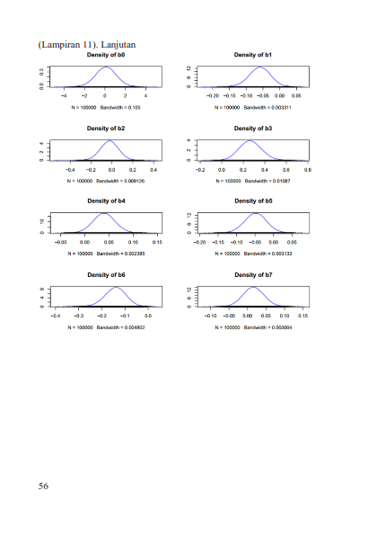

### Bayesian Zero Inflated Poisson
Metode ini adalah merupakan skripsi penulis sendiri. Metode ini digunakan jika
1. Variabel dependen bersifat kategori
2. Nilai variabel dependen banyak yang nol
3. Banyaknya observasi relatif kecil (kurang dari 30)

### Distribusi Poisson
Menurut Walpole (1995), percobaan Poisson akan 
menghasilkan banyaknya sukses selama selang waktu atau pada
daerah tertentu. 
Percobaan Poisson memiliki ciri berikut :
1. Banyaknya sukses yang terjadi dalam suatu selang waktu (daerah) tertentu tidak dipengaruhi oleh apa yang terjadi pada selang waktu (daerah) lain.
2. Peluang terjadinya kejadian sukses (tunggal) dalam selang waktu yang cukup pendek (daerah kecil) sebanding dengan panjang waktu atau besarnya daerah dan tidak tergantung pada banyaknya sukses yang terjadi di luar selang waktu atau daerah tersebut.
3. Peluang terjadinya lebih dari satu kejadian sukses dalam suatu waktu pendek (daerah sempit) dapat diabaikan.

### Regresi Poisson
Regresi Poisson merupakan suatu bentuk analisis regresi yang
digunakan untuk memodelkan data diskrit. Model regresi Poisson
merupakan model standar untuk data diskrit dan termasuk dalam
model regresi linier (Cameron dan Trivedi, 1983).
Asumsi Regresi Poisson menurut Hilbe (2014) :
1. Distribusi peluang diskrit dengan parameter tunggal yaitu rata-rata.
2. Peubah respon berupa bilangan cacah.
3. Antar pengamatan saling bebas. 
4. Peubah respon tidak boleh mengandung banyak nilai nol.
5. Rata-rata dan ragam peubah identik.

### Overdispersi
Winkelmann (2008) menyatakan bahwa metode regresi
Poisson mewajibkan equidispersi, yaitu kondisi di mana nilai ratarata

dan ragam peubah respon bernilai sama atau 𝐸(𝑌 |𝑋) =
𝑉𝑎𝑟(𝑌|𝑋) = 𝜆. Overdispersi berarti ragam lebih besar daripada ratarata

Hipotesis yang melandasi pengujian overdispersi adalah :
	H0 : 𝑉𝑎𝑟(𝑌|𝑋) = 𝐸(𝑌 |𝑋) 
	H1 : 𝑉𝑎𝑟(𝑌|𝑋) > 𝐸(𝑌 |𝑋) 
Pengujian overdispersi menggunakan statistik uji Pearson’s 
Chi-Square yang dapat dipandang sebagai jumlah kuadrat dari
Pearson Residual. 

### Zero Inflated Poisson
Menurut Ghosh dkk (2006) jika peubah respon mengandung  banyak nilai nol (masalah), maka model GLM seperti regresi Poisson dapat menghasilkan penduga underestimate sehingga akan menyulitkan identifikasi parameter yang signifikan. Untuk mengatasi masalah ini, digunakan regresi zero inflated Poisson.  Menurut Liu dan Powers (2012), distribusi ZIP dapat dipandang sebagai kasus khusus dua distribusi gabungan Poisson Bernoulli. ZIP terdiri dari model zero inflation dengan parameter 𝜋 dan model Poisson dengan parameter 𝜆 yang merupakan parameter rata-rata distribusi Poisson (tidak termasuk nilai nol) dan 𝜋 adalah peluang terjadinya nilai nol.

### Metode Bayesian
Menurut Ntzoufras (2009) perbedaan utama metode klasik dan Bayesian yaitu parameter diperlakukan sebagai peubah acak yang ditandai oleh distribusi prior. Karakteristik dasar metode Bayesian yaitu penggunaan peluang untuk mengukur ketidakpastian suatu penduga parameter (Gelman dkk, 2003).  Tujuan utama penerapan metode Bayesian adalah mendapatkan distribusi posterior yang merupakan perkalian antara distribusi prior dan fungsi likelihood. 

### Markov Chain Monte Carlo
Tujuan utama penggunaan metode Bayesian adalah untuk mendapatkan distribusi posterior. Namun, distribusi posterior tidak mudah didapatkan karena mempunyai bentuk yang sangat kompleks, sehingga tidak dapat diselesaikan secara analitik. Oleh karena itu, dikembangkan teknik simulasi MCMC. 

### Gibbs Sampling
Gibbs sampling merupakan algoritma dalam metode MCMC yang digunakan untuk pengambilan sampel distribusi kompleks berdimensi tinggi. Gibbs sampling menggunakan sampel sebelumnya untuk membangkitkan nilai sampel berikutnya secara acak sehingga didapatkan rantai Markov (Walsh, 2004). Gibbs sampling menggunakan distribusi bersyarat penuh yang dihubungkan dengan distribusi posterior.

### Pemeriksaan Konvergensi Algoritma
Pemeriksaan konvergensi MCMC digunakan untuk mengetahui apakah sampel yang dibangkitkan sesuai dengan distribusi target yakni distribusi posterior. Pemeriksaan konvergensi MCMC dapat menggunakan trace plot, MC Error dan autokorelasi.

Output traceplot dan autokorelasi seperti berikut

 

