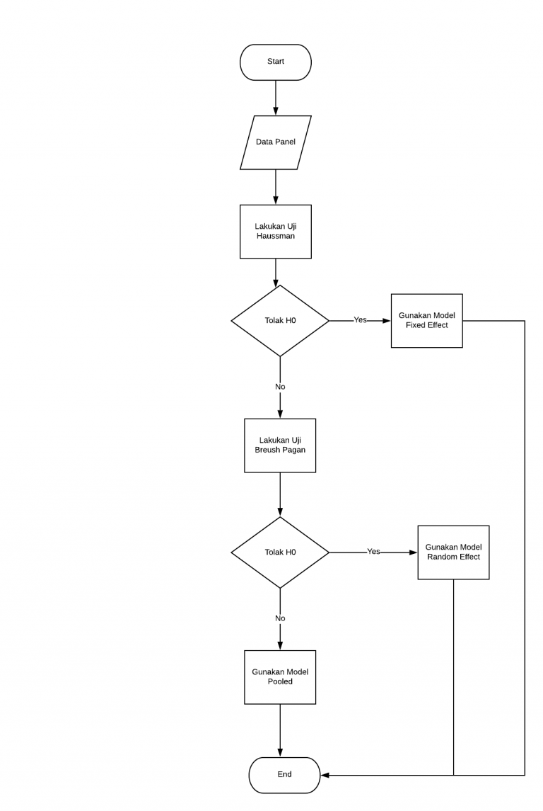
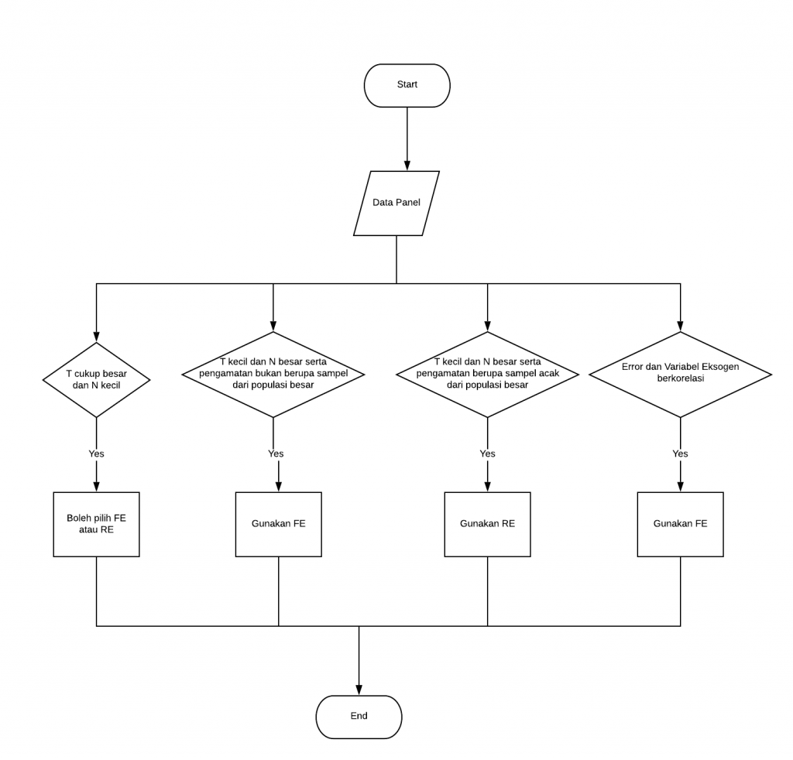

# Analisis Data Panel

Pada dasarnya, analisis data panel berusaha untuk menguraikan keragaman melalui efek waktu dan individu. Secara umum, model data panel dapat dinyatakan sebagai

```
Y{it} = alpha{i} + beta*X{it} + e{it}
```
Model data panel terdiri dari tiga macam yaitu 
1. Fixed Effect
2. Random Effect
3. Pooled Effect. 

Model pooled mengasumsikan bahwa efek individu dan waktu bisa ditangkap oleh intercept dan variabel independent, sehingga cara analisisnya sama seperti analisis regresi berganda.

### 1. Pooled Model

Pooled Model ini adalah model data panel yang paling sederhana. Model ini mengasumsikan bahwa tidak terdapat keragaman antar individu yang tidak terobservasi. Oleh karena itu intercept tidak memiliki index. Sehingga persamaan model ini yaitu

```
Y{it} = alpha + beta*X{it} + e{it}
```

### 2. Fixed Effect Model (FE)

Adanya variabel yang tidak semuanya masuk dalam persamaan model memungkinkan adanya intercept yang berbeda untuk setiap individu dan waktu. Pemikiran inilah yang yang menjadi dasar pembentukan model. Persamaan model Fixed Effect yaitu

```
Y{it} = alpha{i} + beta*X{it} + e{it}

```

alpha dan peubah eksogen diasumsikan masih terdapat hubungan.

### 3. Random Effect Model (RE)

Pada model FE, keragaman setiap individu dan atau waktu ditangkap oleh intercept, Sedangkan pada model RE dicerminkan oleh error. Persamaan model RE sama dengan model FE yaitu

```
Y{it} = alpha{i} + beta*X{it} + e{it}

```
alpha dan peubah eksogen diasumsikan saling bebas.


# Flowchart (1)


# Flowchart (2)
