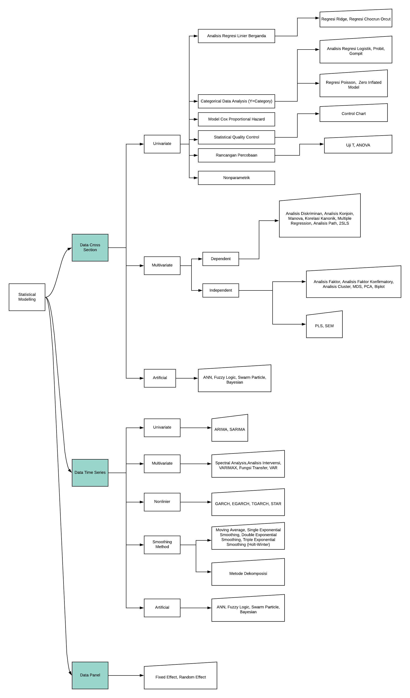

### STATISTIKA

Karl Pearson menyatakan bahwa “Statistics is the Grammar of Science”. Seringkali istilah statistika dan statistik sering disamakan, padahal mereka berbeda. Statistika merujuk kepada cabang ilmu, sedangkan statistik lebih merujuk kepada suatu data atau informasi.

Menurut Supranto, statistika adalah suatu cabang ilmu yang mempelajari tentang cara pengumpulan, penyajian, menganalisis data serta mengambil kesimpulan secara umum berdasarkan hasil penelitian menyeluruh yang telah dilakukan.

### CABANG STATISTIKA

Statistika dapat dibagi menjadi dua bagian besar yaitu Statistika Deskriptif dan Statistika Inferensia. 
1. Statistika Deskriptif mencakup semua metode yang hanya berusaha untuk memberikan gambaran dan penyajian data serta tidak melakukan penarikan kesimpulan . Metode-metode nya seperti grafik (barchart,linechar,scatterplot, dkk), statistik 5 serangkai (min,max,Q1,Q2,Q3).

2. Statistika Inferensia mencakup semua metode analisis data yang bertujuan untuk melakukan penarikan kesimpulan. Metode metode nya seperti regresi berganda, regresi logistik, ARIMA, ARCH, Random Effect, Analisis Path, PCA, Exponential Smoothing dan lainnya.
 

### STATISTIKA INFERENSIA
Berdasarkan dimensi data, teknik analisis data dapat dibagi menjadi
1. Analisis Data Cross Section
2. Analisis Data Time Series
3. Analisis Data Panel

Berdasarkan butuh atau tidaknya asumsi, teknik analisis data dapat dibagi menjadi
1. Statistika Parametrik
2. Statistika Non-Parametrik

