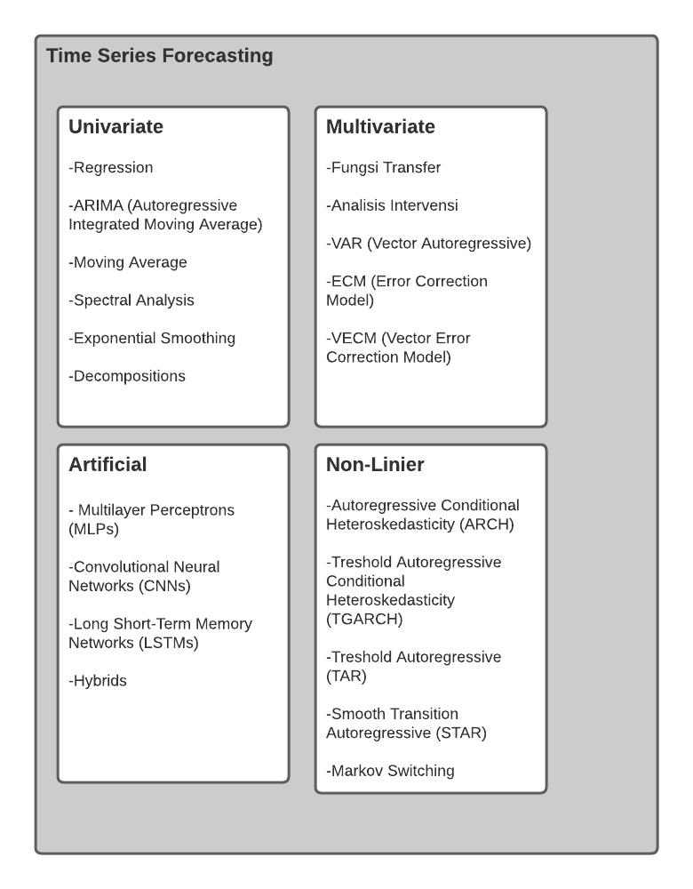

# TIME SERIES

Data time series adalah data yang dikumpulkan dari waktu ke waktu. Suatu data mungkin dikumpulkan dalam bentuk berbagai dimensi waktu seperti jam, harian, mingguan, bulanan, dan tahunan. Kadangkala kita punya ketertarikan untuk menganalisis data deret dan membuat ramalan terhadap beberapa periode ke depan.

Analisis data deret waktu dapat digolongkan menjadi beberapa jenis yaitu
1. Univariate (tidak ada regresor)
2. Multivariate (menambahkan regresor)
3. Non-Linier 

Beberapa contoh metode yang dapat digunakan dalam analisis data deret waktu adalah
1. ARIMA (Autoregressive Integrated Moving Average)
2. Exponential Smoothing 
3. GARCH
4. Dekomposisi
5. VAR
6. STAR (Space Time Autoregressive)
7. Holt Winter
8. Fuzzy 

# Taksonomi

# Flowchart

