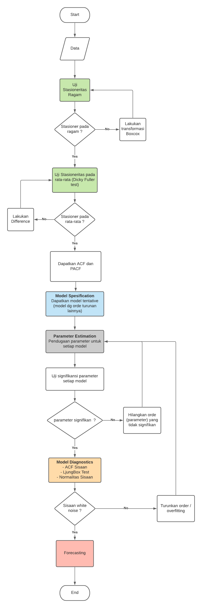

# ARIMA (Autoregresive Integrated Moving Average)

Model ARIMA dibagi dalam 3 unsur yaitu: model autoregressive (AR), moving average (MA), dan integrated (I). Ketiga unsur ini dimodifikasi sehingga membentuk model baru, misalnya model autoregressive dan moving average (ARMA). Bentuk umumnya adalah ARIMA (p,d,q) di mana p menyatakan ordo autoregressive, d menyatakan ordo Integrated dan q menyatakan ordo moving average. 

- Makna dari AR adalah nilai x dipengaruhi oleh nilai x periode sebelumnya hingga periode ke-p. Jadi yang berpengaruh di sini adalah variabel itu sendiri. 
- Makna dari moving average yaitu nilai variabel x dipengaruhi oleh error dari variable x tersebut - Makna integrated menyatakan difference dari data. Adanya orde I menyatakan bahwa data tidak stasioner

## Model ARIMA

Model ARIMA(p,d,q) adalah

# Flowchart (ARIMA)

