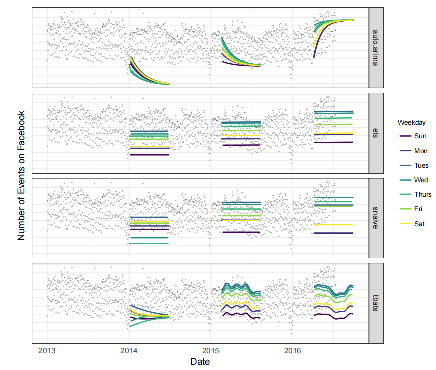
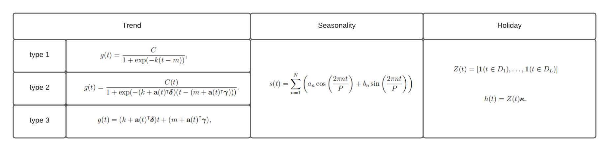
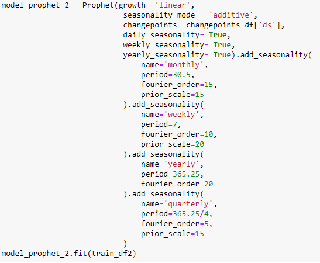

# fbprophet

## Latar Belakang
Forecasting merupakan salah satu algoritma data science yang membantu suatu organisasi/perusahaan di dalam planning, goal setting dan anomaly detection. Namun terdapat tantangan serius dalam forecasting yaitu

1. Menghasilkan ramalan yang reliabel dan berkualitas tinggi
2. Terdapat banyak jenis analisis time series
3. Analyst yang ahli dalam time series masih jarang
4. Permintaan hasil ramalan yang berkualitas tinggi banyak namun pace nya lama.

Oleh karena itu diciptakanlah **fbprophet** agar analyst yang tidak ahli time series bisa menggunakannya dan bisa disesuaikan parameternya berdasarkan pengetahuan domain expertisenya. 

## Other method
Beberapa metode yang dibuat perbandingan dengan fbprophet adalah
1. ARIMA (Autoregresive Integrated Moving Average) -> menggunanakan auto.arima
2. Exponential Smoothing -> menggunakan ets
3. Seasonal Naive -> menggunakan snaive
4. TBATS (Exponential Smoothing State Space Model With Box-Cox Transformation, ARMA Errors, Trend And Seasonal Components) -> menggunakan tbats



Dapat dikatakan bahwa metode ARIMA tidak mampu menaganani pola musiman. Exponential smoothing dan seasonal naive berhasil menangkan pola weekly-seasonality tetapi tidak untuk longer-term seasonality.

## Konsep dasar
Fbprophet menggunakan model dekomposisi dengan tiga model komponen utama yaitu trend, seasonality, dan holidays. 

```
y(t) = g(t) + s(t) + h(t) + e(t)
```
- g(t) : trend function which models non-periodic changes in the value of the time series
- s(t) : periodic changes (e.g weekly & yearly seasonality)
- h(t) : effects of holidays
- e(t) : any idiosyncratic changes which are not accomodated by the model

assumption : e(t) berdistribusi normal

## Formula setiap komponen




## Tuning parameter by Analyst
Analyst making forecasts often have extensive domain knowledge about the quantity they are forecasting, but limited statistical knowledge. In the Prophet model spesification there are several places where analyst can alter the model to apply their expertise. 

- Capatities : Analyst may have external data for the total market size and can apply that knowledge directly by specifying capatities.
- Changepoints : Knowsn dates of changepoints, such as dates of product changes, can be directly specified
- Holidays dan seasonality : Analyst that we work with have experience with which holidays impact growth in which regions, and they can directly input the relevant holidays dates and the applicabel time sclaes of seasonalitu.
- Smoothing parameters : By adjusting t an analyst can select from within a range of more global orn locally smooth models. The seasonalitu and holiday smooting parameters allow the analyst to tell the model how much of the historical seasonal variation is expected in the future.


### Fit Model



### Source
1. https://facebook.github.io/prophet/
2. https://doi.org/10.7287/peerj.preprints.3190v2

